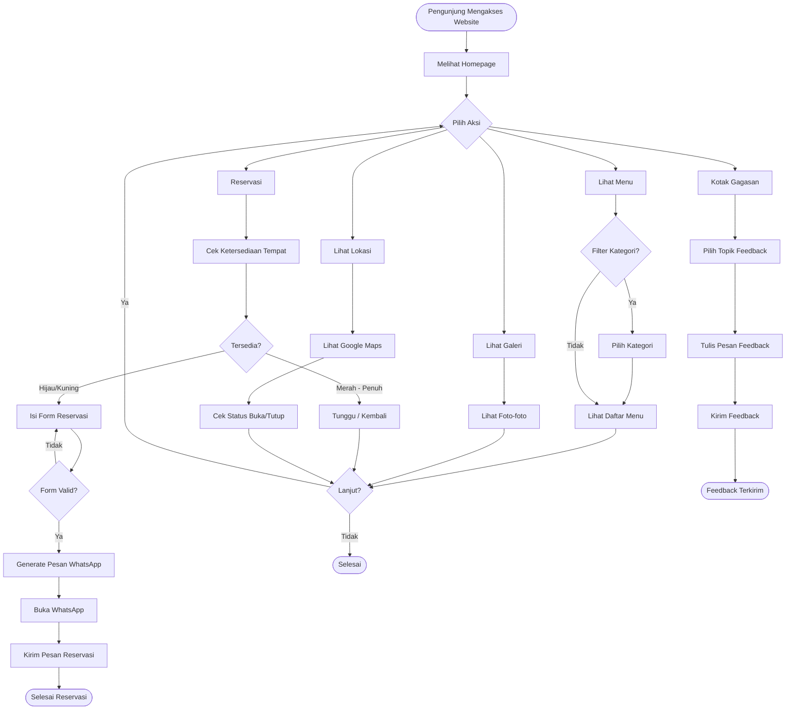
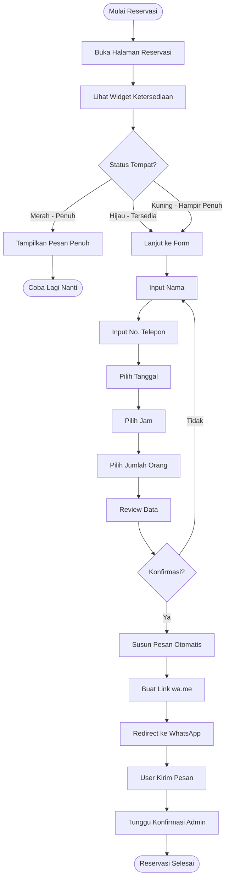
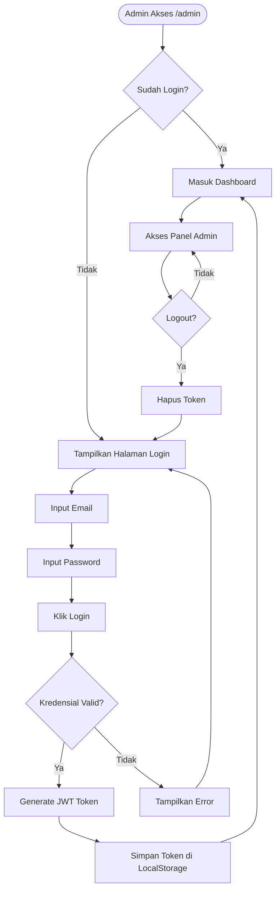
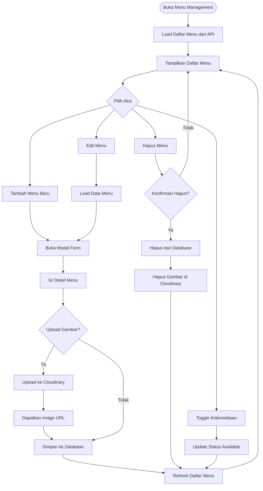
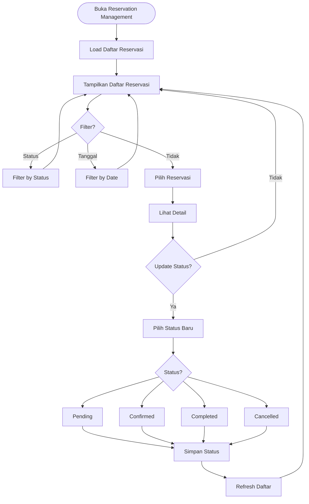
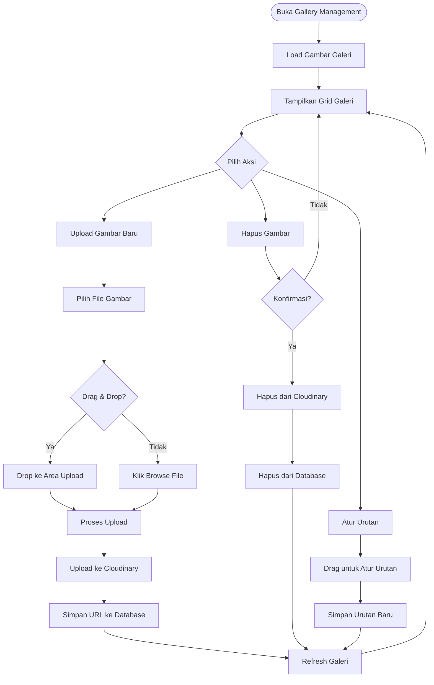
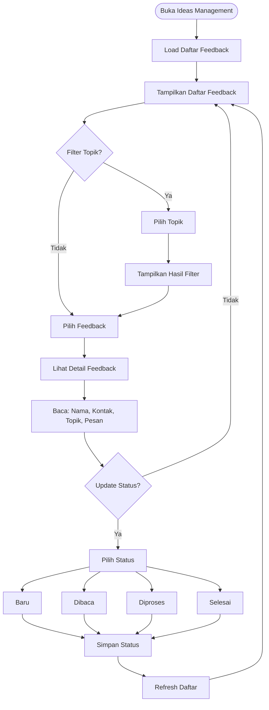
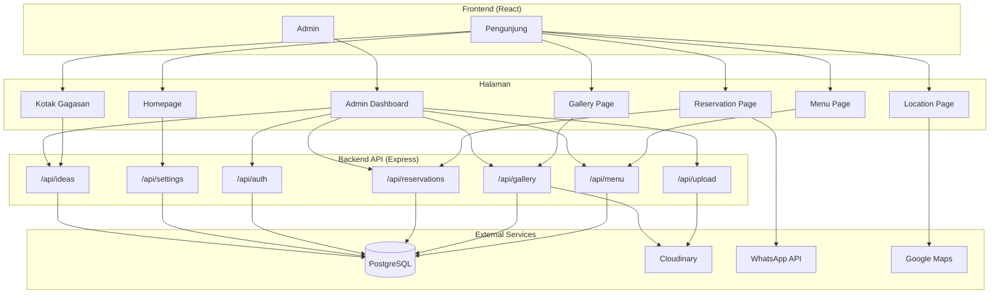

# 📊 Activity Diagram - RuangKopi

## 1. Alur Pengunjung (Visitor Flow)

---

## 2. Alur Reservasi Detail

---

## 3. Alur Admin Login

---

## 4. Alur Admin - Kelola Menu

---

## 5. Alur Admin - Kelola Reservasi

---

## 6. Alur Admin - Kelola Galeri

---

## 7. Alur Admin - Kelola Kotak Gagasan

---

## 8. Flow Sistem Keseluruhan

---

*Diagram dibuat menggunakan Mermaid untuk visualisasi alur aplikasi RuangKopi* ☕
