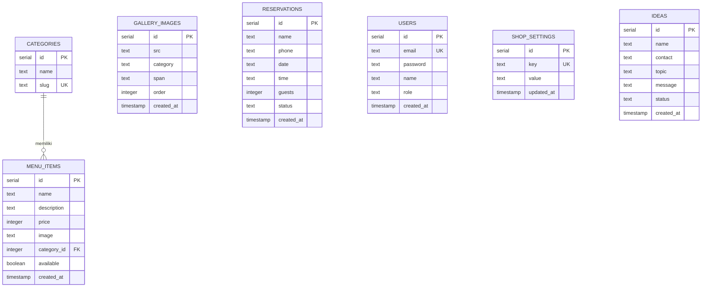
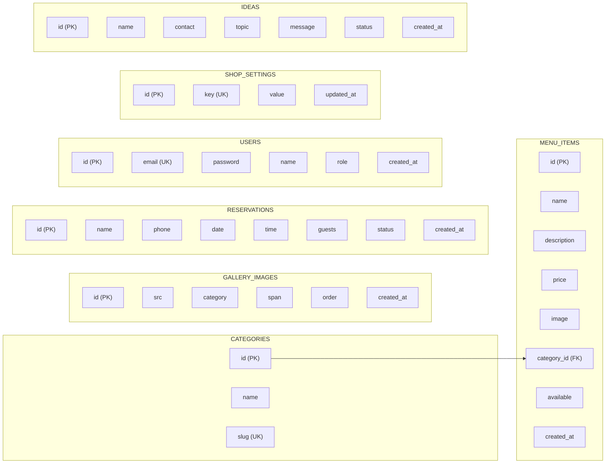

# 📊 Database Diagram - RuangKopi

## Entity Relationship Diagram (ERD)

---

## Logical Record Structure (LRS)

---

## Deskripsi Tabel

### 1. CATEGORIES
Menyimpan kategori menu (Coffee, Non-Coffee, Snacks, dll)

| Field | Type | Constraint | Keterangan |
|-------|------|------------|------------|
| id | SERIAL | PRIMARY KEY | Auto increment |
| name | TEXT | NOT NULL | Nama kategori |
| slug | TEXT | UNIQUE, NOT NULL | URL-friendly name |

---

### 2. MENU_ITEMS
Menyimpan item menu kopi dan makanan

| Field | Type | Constraint | Keterangan |
|-------|------|------------|------------|
| id | SERIAL | PRIMARY KEY | Auto increment |
| name | TEXT | NOT NULL | Nama menu |
| description | TEXT | - | Deskripsi menu |
| price | INTEGER | NOT NULL | Harga dalam Rupiah |
| image | TEXT | - | URL gambar (Cloudinary) |
| category_id | INTEGER | FOREIGN KEY → categories.id | Relasi ke kategori |
| available | BOOLEAN | NOT NULL, DEFAULT true | Status tersedia |
| created_at | TIMESTAMP | NOT NULL, DEFAULT NOW() | Waktu dibuat |

---

### 3. GALLERY_IMAGES
Menyimpan gambar galeri coffee shop

| Field | Type | Constraint | Keterangan |
|-------|------|------------|------------|
| id | SERIAL | PRIMARY KEY | Auto increment |
| src | TEXT | NOT NULL | URL gambar (Cloudinary) |
| category | TEXT | NOT NULL | Kategori gambar |
| span | TEXT | - | CSS class untuk grid layout |
| order | INTEGER | NOT NULL, DEFAULT 0 | Urutan tampil |
| created_at | TIMESTAMP | NOT NULL, DEFAULT NOW() | Waktu dibuat |

---

### 4. RESERVATIONS
Menyimpan data reservasi pelanggan

| Field | Type | Constraint | Keterangan |
|-------|------|------------|------------|
| id | SERIAL | PRIMARY KEY | Auto increment |
| name | TEXT | NOT NULL | Nama pelanggan |
| phone | TEXT | NOT NULL | No. telepon |
| date | TEXT | NOT NULL | Tanggal (YYYY-MM-DD) |
| time | TEXT | NOT NULL | Jam (HH:MM) |
| guests | INTEGER | NOT NULL | Jumlah tamu |
| status | TEXT | NOT NULL, DEFAULT 'Pending' | Status: Pending/Confirmed/Completed/Cancelled |
| created_at | TIMESTAMP | NOT NULL, DEFAULT NOW() | Waktu dibuat |

---

### 5. USERS
Menyimpan data admin untuk autentikasi

| Field | Type | Constraint | Keterangan |
|-------|------|------------|------------|
| id | SERIAL | PRIMARY KEY | Auto increment |
| email | TEXT | UNIQUE, NOT NULL | Email admin |
| password | TEXT | NOT NULL | Password (bcrypt hash) |
| name | TEXT | NOT NULL | Nama admin |
| role | TEXT | NOT NULL, DEFAULT 'admin' | Role: admin/staff |
| created_at | TIMESTAMP | NOT NULL, DEFAULT NOW() | Waktu dibuat |

---

### 6. SHOP_SETTINGS
Menyimpan pengaturan toko (key-value store)

| Field | Type | Constraint | Keterangan |
|-------|------|------------|------------|
| id | SERIAL | PRIMARY KEY | Auto increment |
| key | TEXT | UNIQUE, NOT NULL | Nama setting |
| value | TEXT | NOT NULL | Nilai setting (JSON/string) |
| updated_at | TIMESTAMP | NOT NULL, DEFAULT NOW() | Waktu diupdate |

**Contoh data:**
- `key: "status"` → `value: "available"` (Status ketersediaan tempat)
- `key: "space_images"` → `value: "[{...}]"` (Gambar homepage)

---

### 7. IDEAS
Menyimpan feedback dari pelanggan (Kotak Gagasan)

| Field | Type | Constraint | Keterangan |
|-------|------|------------|------------|
| id | SERIAL | PRIMARY KEY | Auto increment |
| name | TEXT | NOT NULL | Nama pengirim |
| contact | TEXT | - | Email/Instagram (opsional) |
| topic | TEXT | NOT NULL | Topik: Soal Rasa/Suasana Ruang/Pelayanan/Ide Baru |
| message | TEXT | NOT NULL | Isi pesan |
| status | TEXT | NOT NULL, DEFAULT 'Baru' | Status: Baru/Dibaca/Diproses/Selesai |
| created_at | TIMESTAMP | NOT NULL, DEFAULT NOW() | Waktu dibuat |

---

## Relasi Antar Tabel

| Relasi | Jenis | Keterangan |
|--------|-------|------------|
| CATEGORIES → MENU_ITEMS | One-to-Many | Satu kategori memiliki banyak menu |

> [!NOTE]
> Tabel lain (GALLERY_IMAGES, RESERVATIONS, USERS, SHOP_SETTINGS, IDEAS) bersifat **independen** dan tidak memiliki relasi foreign key dengan tabel lain.

---

*Diagram dibuat berdasarkan schema Drizzle ORM di `apps/api/src/db/schema.ts`* ☕
