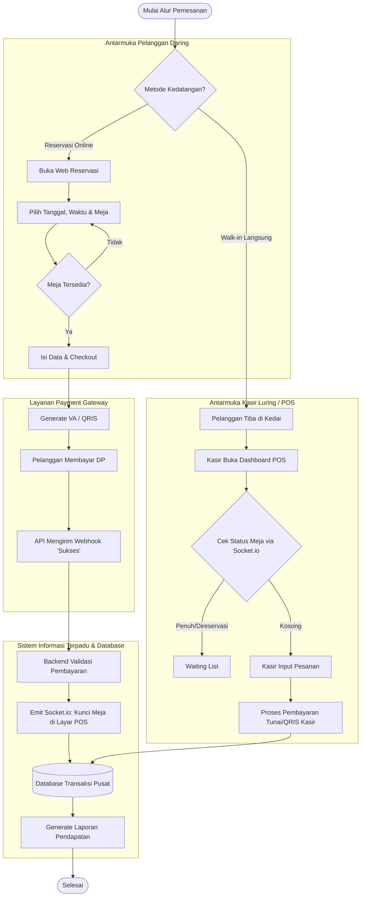
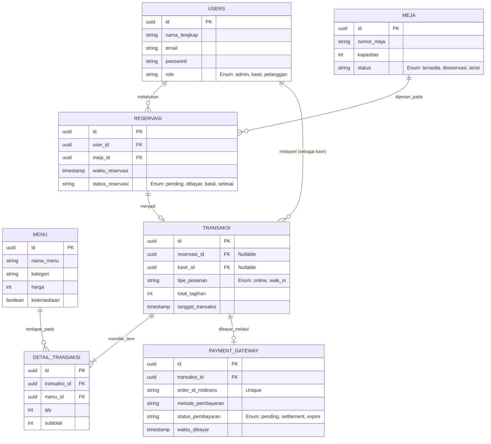

# PRODUCT REQUIREMENTS DOCUMENT (PRD)

**Nama Proyek:** Kedai Ruang Kopi - *Integrated POS & Reservation System*
**Dokumen Pemilik:** Ilyas Nur Putra Kautsar (Peneliti / *Lead Developer*)
**Status Dokumen:** Draf / Perencanaan Lanjutan

---

## 1. Ringkasan Eksekutif
Proyek ini mengembangkan sistem informasi terpadu berskala mikro (*micro-ERP*) untuk Kedai Ruang Kopi. Sistem ini dirancang untuk menjembatani asinkronisasi data antara reservasi daring pelanggan dan operasional luring kasir. Dengan mengintegrasikan *Payment Gateway* dan modul *Point of Sales* (POS) dalam satu arsitektur terpusat, sistem ini mengeliminasi validasi pembayaran manual, mencegah *double booking* meja secara *real-time*, dan menghasilkan rekapitulasi pelaporan keuangan gabungan yang presisi.

## 2. Tujuan & Metrik Keberhasilan
* **Otomatisasi Validasi:** 100% transaksi uang muka (DP) reservasi divalidasi otomatis melalui *webhook Payment Gateway*, tanpa intervensi manual administrator.
* **Akurasi Sinkronisasi:** Keterlambatan (*latency*) penguncian status meja dari reservasi daring ke layar POS luring berada di bawah 2 detik.
* **Sentralisasi Laporan:** Kesalahan rekapitulasi data antara daring dan luring (*human error*) ditekan hingga 0%.

## 3. Target Pengguna (*User Personas*)

| Peran (*Role*) | Deskripsi Kebutuhan Utama |
| :--- | :--- |
| **Pelanggan** | Membutuhkan antarmuka web yang responsif untuk memesan meja, memilih tanggal/waktu, dan membayar uang muka menggunakan metode nirtunai (QRIS/VA) secara aman. |
| **Kasir / Barista** | Membutuhkan *dashboard* POS yang cepat, informatif (melihat ketersediaan meja secara *real-time*), dan tidak memuat ulang (*reload*) halaman saat memproses pesanan *walk-in*. |
| **Admin / Pemilik** | Membutuhkan *dashboard* terpusat untuk melihat rekapitulasi pendapatan harian gabungan, mengelola katalog menu, dan mengatur *shift* kasir. |

## 4. Ruang Lingkup & Batasan Masalah
* **Di Dalam Lingkup (*In-Scope*):** Integrasi API Midtrans/Xendit untuk reservasi web, *dashboard* POS SPA (*Single Page Application*), manajemen status meja *real-time*, laporan pendapatan gabungan.
* **Di Luar Lingkup (*Out-of-Scope*):** Modul inventaris gudang/penyusutan bahan baku mentah (*Bill of Materials*), akuntansi pengeluaran operasional (gaji, listrik), sistem *refund* otomatis melalui API.

## 5. Arsitektur & Teknologi (*Tech Stack*)
* **Manajemen Proyek:** Turborepo (*Monorepo*).
* **Antarmuka (*Frontend*):** React.js / Next.js, Tailwind CSS, shadcn/ui.
* **Logika Antarmuka:** Zustand (*State Management*), TanStack Query (*Data Fetching*), react-to-print (Cetak Struk Thermal).
* **Peladen (*Backend*):** Node.js dengan Express.js.
* **Basis Data & ORM:** PostgreSQL dengan Drizzle ORM.
* **Integrasi Pihak Ketiga:** Midtrans/Xendit (Pembayaran), Socket.io (Komunikasi *Real-time* untuk sinkronisasi meja).

---

## 6. Diagram Alur Aplikasi (*App Flow*)

---

## 7. Perancangan Basis Data (ERD)

---

## 8. Rincian Fitur Utama

### 8.1 Modul Reservasi Daring (Pelanggan)
* **Katalog Interaktif:** Menampilkan galeri menu dan foto suasana kedai.
* **Manajemen Jadwal:** Validasi kalender untuk memastikan tanggal dan waktu belum terlewat, dipadukan dengan cek status ketersediaan meja dari basis data.
* **Snap Pembayaran:** Integrasi pop-up Midtrans untuk pembayaran DP secara instan di dalam antarmuka web.

### 8.2 Modul POS (Kasir)
* **Layout SPA:** Layar terbagi dua: Daftar Menu (kiri) dan Keranjang/Tagihan (kanan).
* **Keranjang Global (Zustand):** Kasir dapat memasukkan pesanan, menghapusnya, atau mengubah kuantitas secara responsif.
* **Peta Meja *Real-Time*:** Visualisasi grid meja dengan warna yang diatur via Socket.io. Hijau (tersedia), Merah (direservasi daring), Kuning (diisi *walk-in*).
* **Cetak Struk:** Integrasi komponen `react-to-print` untuk mencetak bukti transaksi fisik ke *printer thermal*.

### 8.3 Modul Administrator
* **Dashboard Keuangan:** Grafik batang/garis pendapatan harian, persentase kontribusi jalur *online* vs *walk-in*.
* **Master Data:** Operasi CRUD penuh untuk tabel `menu` (ubah harga/stok) dan tabel `meja`.
* **Manajemen Pembatalan:** Tombol manual untuk membatalkan reservasi (melepas kuncian meja) dan menyesuaikan laporan secara otomatis.