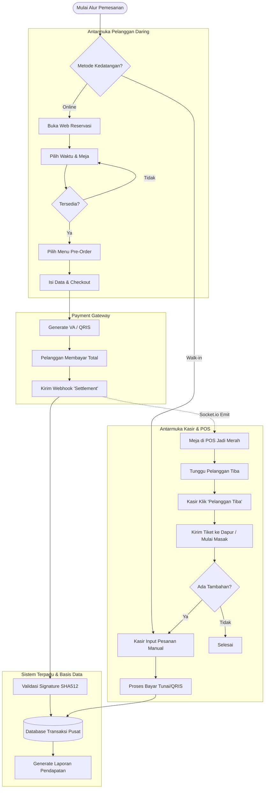
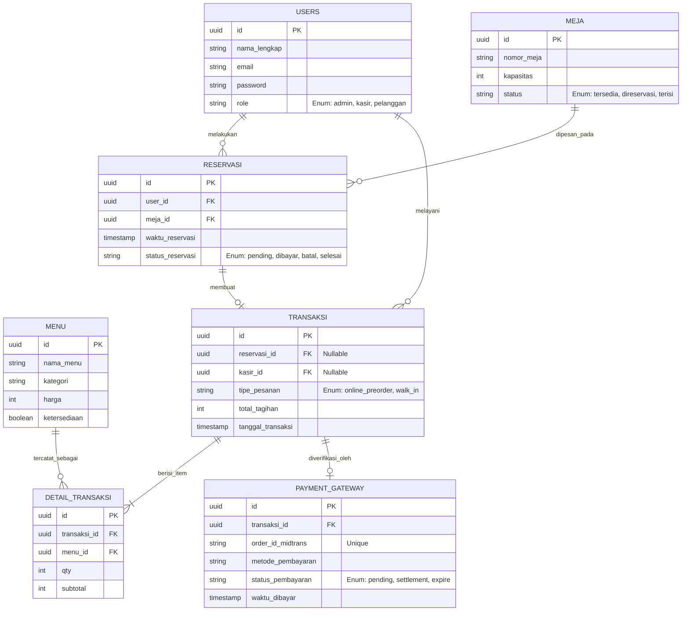

# PRODUCT REQUIREMENTS DOCUMENT (PRD) v2.0

**Nama Proyek:** Kedai Ruang Kopi - *Integrated POS & Self-Ordering System*
**Dokumen Pemilik:** Ilyas Nur Putra Kautsar (Peneliti / *Lead Developer*)
**Status Dokumen:** Draf / Perencanaan Lanjutan

---

## 1. Ringkasan Eksekutif
Proyek ini mengembangkan sistem informasi terpadu berskala mikro (*micro-ERP*) untuk Kedai Ruang Kopi. Sistem ini dirancang untuk memecahkan masalah asinkronisasi data antara reservasi daring dan operasional kasir luring. Pada versi pembaruan ini, sistem ditingkatkan menjadi **Sistem Pemesanan Mandiri (Self-Ordering System)** di mana pelanggan tidak hanya memesan meja, tetapi juga dapat melakukan pra-pesan (*pre-order*) menu secara daring. Integrasi dengan Payment Gateway memungkinkan validasi pembayaran otomatis dan penguncian meja secara *real-time*, sekaligus memaksimalkan arus kas dan efisiensi operasional.

## 2. Tujuan & Metrik Keberhasilan
* **Otomatisasi Validasi:** 100% transaksi daring divalidasi otomatis melalui *webhook* Payment Gateway.
* **Akurasi Sinkronisasi:** Keterlambatan (*latency*) penguncian status meja di layar POS luring berada di bawah 2 detik.
* **Peningkatan Efisiensi Dapur:** Waktu tunggu pelanggan untuk penyajian makanan menurun karena dapur sudah menerima daftar *pre-order* sebelum kedatangan.
* **Sentralisasi Laporan:** Kesalahan rekapitulasi data pendapatan harian ditekan hingga 0%.

## 3. Target Pengguna (*User Personas*)

| Peran (*Role*) | Deskripsi Kebutuhan Utama |
| :--- | :--- |
| **Pelanggan** | Membutuhkan antarmuka web untuk memesan meja, melihat katalog menu, memasukkan pesanan ke keranjang (*cart*), dan membayar total tagihan menggunakan QRIS/VA secara aman. |
| **Kasir / Barista** | Membutuhkan *dashboard* POS yang informatif (melihat meja yang telah dipesan beserta isi pesanannya secara otomatis) dan tombol konfirmasi "Pelanggan Tiba" untuk memicu proses masak. |
| **Admin / Pemilik** | Membutuhkan *dashboard* terpusat untuk melihat rekap pendapatan gabungan dan mengelola ketersediaan master data (menu dan meja). |

## 4. Ruang Lingkup & Batasan Masalah
* **Di Dalam Lingkup (*In-Scope*):** *Pre-order* menu saat reservasi, integrasi API Midtrans/Xendit, manajemen status meja *real-time* via Socket.io, *dashboard* POS SPA, autentikasi berbasis *Role* (RBAC), dan laporan sentral.
* **Di Luar Lingkup (*Out-of-Scope*):** Modul inventaris gudang (penyusutan gramasi bahan baku mentah), akuntansi pengeluaran (gaji, listrik), sistem *refund* otomatis via API.

## 5. Keamanan Sistem (*Security Requirements*)
* **Autentikasi & RBAC:** Menggunakan JSON Web Tokens (JWT) dan *middleware* Express.js untuk membatasi akses URL berdasarkan *role* (Admin, Kasir, Pelanggan).
* **Webhook Signature:** Wajib melakukan komputasi HMAC SHA512 pada *payload* dari Payment Gateway untuk memastikan notifikasi pembayaran sah dan tidak bisa di-*spoofing*.
* **Password Hashing:** Enkripsi *password* menggunakan `bcrypt`.
* **API Protection:** Implementasi Helmet.js (HTTP Headers), CORS, dan Rate Limiting pada *endpoint* krusial (login, checkout).

## 6. Arsitektur & Teknologi (*Tech Stack*)
* **Manajemen Proyek:** Turborepo (*Monorepo*).
* **Antarmuka (*Frontend*):** React.js / Next.js, Tailwind CSS, shadcn/ui.
* **Logika Antarmuka:** Zustand (*Global Cart State* pelanggan & kasir), TanStack Query (*Data Fetching*), react-to-print.
* **Peladen (*Backend*):** Node.js dengan Express.js.
* **Basis Data & ORM:** PostgreSQL dengan Drizzle ORM.
* **Integrasi Eksternal:** Midtrans/Xendit, Socket.io.

---

## 7. Diagram Alur Aplikasi (*App Flow*)

---

## 8. Perancangan Basis Data (ERD)
*Catatan: Struktur telah mendukung pre-order karena entitas `RESERVASI` memiliki relasi langsung dengan pembuatan keranjang `DETAIL_TRANSAKSI` lewat tabel sentral `TRANSAKSI`.*

---

## 9. Rincian Fitur Utama

### 9.1 Modul Reservasi & Self-Ordering Daring (Pelanggan)
* **Katalog Interaktif (Zustand):** Mengelola *state* keranjang belanja pelanggan secara global di *browser* saat mereka memilih meja dan menu.
* **Manajemen Jadwal:** Validasi ketersediaan meja berdasarkan *timestamp* di PostgreSQL.
* **Checkout & Payment:** Mengirim *payload* detil pesanan (termasuk harga menu) ke Midtrans Snap API agar rincian muncul di halaman pembayaran.

### 9.2 Modul POS (Kasir)
* **Peta Meja *Real-Time* (Socket.io):** Sinkronisasi instan warna meja.
* **Integrasi Pre-Order:** Ketika Kasir mengeklik meja yang "Direservasi Daring", keranjang kasir (*cart*) langsung menampilkan menu-menu yang sudah dibayar pelanggan tersebut secara otomatis (menarik data dari `DETAIL_TRANSAKSI`).
* **Fitur "Pelanggan Tiba" (Fire Order):** Tombol khusus di POS untuk mengirimkan tiket instruksi masak ke area dapur, mencegah pesanan *pre-order* menjadi dingin sebelum pelanggan benar-benar tiba di lokasi.
* **Penggabungan Tagihan (Add-on):** Jika pelanggan *pre-order* memesan tambahan (misal: air mineral) secara luring, kasir dapat menambahkannya ke meja yang sama tanpa mengganggu pembayaran pertama yang sudah lunas.

### 9.3 Modul Administrator
* **Dashboard Keuangan:** Rekapitulasi pendapatan sentral yang tidak membedakan uang masuk dari web maupun laci kasir tunai.
* **Master Data & Hak Akses:** Pengelolaan menu, ketersediaan meja, dan pembuatan akun Kasir baru (pemberian akses *Role*).
